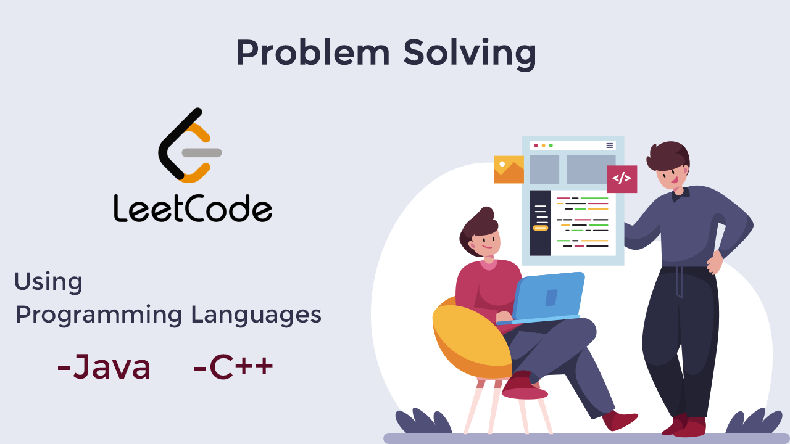

# Leetcode

Leetcode Problems

# Problems

| #   | Problem                             | Topic                  | Companies                                       | level | Language  |
|-----|-------------------------------------|------------------------|-------------------------------------------------|-------|-----------|
| 1   | 121 Best Time to Buy and Sell Stock | Sliding Window, Arrays | Amazon Google Facebook Uber Microsoft bloomberg | Easy  | java  C++ |
| 2   | 704  Binary Search                  | Binary Search          | Microsoft                                       | Easy  | java      |

1. running-sum-of-1d-array
2. palindrome-number
3. longest-common-prefix
4. Valid Parentheses
5. Sqrt(x)
6. Valid Palindrome 125
7. Single Number 136
8. Valid Anagram 424
9. Majority Element 169
10. Maximum Subarray 53
11. Best Time to Buy and Sell Stock 121 ########
12. Move Zeroes 283
13. Maximum Number of Balloons 1189
14. Pascal's Triangle 118
15. Find Numbers with Even Number of Digits 1295
16. Check If It Is a Straight Line 1232
17. Number of Equivalent Domino Pairs 1128
18. Two Sum II - Input Array Is Sorted 167
19. Reverse Integer 7
20. Find All Numbers Disappeared in an Array 448
21. Implement strStr() 28
22. Remove Duplicates from Sorted Array 26
23. Reverse Linked List 206
24. Missing Number 268
25. Word Pattern 290
26. Valid Perfect Square 367
27. Find First and Last Position of Element in Sorted Array 34
28. Find Target Indices After Sorting Array 2089
29. Rank Transform of an Array 1331
30. Power of Two 231
31. Remove Element 27
32. Min Stack 155
33. Plus One 66
34. Intersection of Two Arrays 349
35. Can Place Flowers 605
36. Contains Duplicate 217
37. Unique Email Addresses 929
38. Delete Node in a Linked List 237
39. Sort Array by Increasing Frequency 1636
40. Remove Linked List Elements 203
41. Slowest Key 1629
42. Largest Substring Between Two Equal Characters 1624
43. Replace Elements with Greatest Element on Right Side 1299
44. Binary Search 704
45. Arranging Coins 441
46. Set Matrix Zero 73
47. Guess Number Higher or Lower 374
48. Length of Last Word 58
49. Range Sum of BST 938
50. Increasing Order Search Tree 897
51. Squaring Sorted Array
52. Fruit Into Baskets
53. 3Sum Closest
54. Find Greatest Common Divisor of Array 1979.

